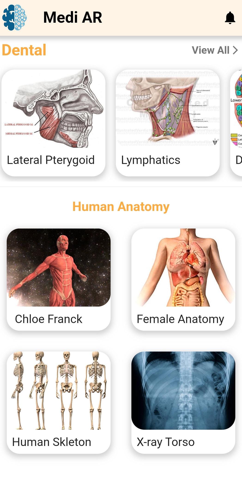
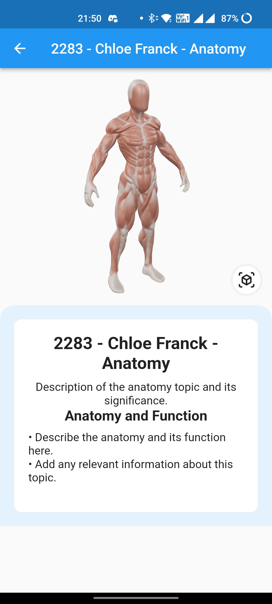
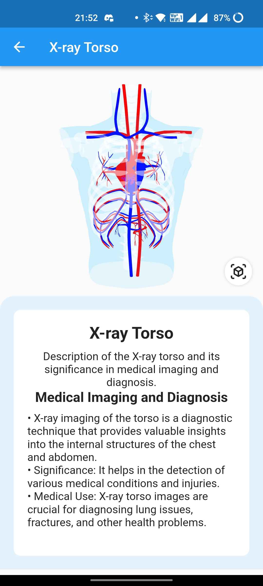
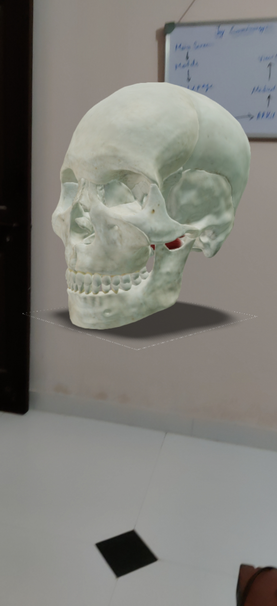

# AR Car Showroom
## Overview
AR Car Viewer is a mobile application developed using Flutter framework which provides users the ability to view cars in an augmented reality (AR) environment. The app aims to give users a unique car viewing experience, allowing them to visualize cars in a real-world environment using their mobile device camera.
## Screenshots
### Click below to watch Video
[Click here to watch the video](https://youtube.com/shorts/8CiHawyc4zg?feature=share)
|       Home Screen       |       Dental       |       Dental        |
| :----------------------: | :----------------------: | :----------------------: |
|  |  |  |

|       Human Anatomy       |       Human Anatomy       |       Human Anatomy        |
| :----------------------: | :----------------------: | :----------------------: |
|  |  |  |

## Features
-View cars in an augmented reality environment
-Browse a list of available cars
-View car details, including name, model, price, and specifications
-Rotate and move the car to view it from different angles
-Take a screenshot of the AR view and save it to the gallery
-Share the screenshot with friends and family

- View cars in an augmented reality environment
- Browse a list of available cars 🏎️
- View car details, including name, model, price, and specifications
- Rotate and move the car to view it from different angles
- Take a screenshot of the AR view and save it to the gallery
- Share the screenshot with friends and family 📱

## Technology Stack

- Flutter 2.5.3
- ARKit (iOS) and ARCore (Android)
- Blender
- Flutter Packages: camera, image_gallery_saver, ar_flutter_plugin,path_provider,model_viewer_plus

## Installation and Setup

- Clone the repository from GitHub: https://github.com/Churanta/Hackverse-4.0.git
- Open the project in Android Studio or Visual Studio Code
- Install the required packages by running the command flutter pub get
- Connect your mobile device to your computer and enable USB debugging
- Run the app on your mobile device using flutter run

## Usage

- Open the app and browse the list of available cars
- Select a car to view in AR
- Use your mobile device camera to scan your surroundings and place the car in the desired location
- Use your fingers to rotate and move the car to view it from different angles
- Take a screenshot of the AR view and save it to the gallery
- Share the screenshot with friends and family 🙂

## Code Structure

- 'main.dart' : Endpoint of the app
- 'MainPage.dart' : Home screen with a list of available cars
- 'cars' : AR Screen to view car details

## Contributors

- [Churanta Mondal](https://github.com/Churanta)
- [Gurram Mahananda Reddy](https://github.com/nandu5g2)
- [Darshan Sithan](https://www.linkedin.com/in/darshan-sithan/?lipi=urn%3Ali%3Apage%3Ad_flagship3_people_connections%3B3XpbuuW0TUegNf5MAEYIkQ%3D%3D)

## Future Plans

- Add more cars to the list
- Improve AR accuracy and stability
- Add support for more mobile devices
- Implement car customization features

## Future Plans

- Add more cars to the list
- Improve AR accuracy and stability
- Add support for more mobile devices
- Implement car customization features

## License

This project is licensed under the MIT License - see the LICENSE.md file for details..
# MedARLearn
