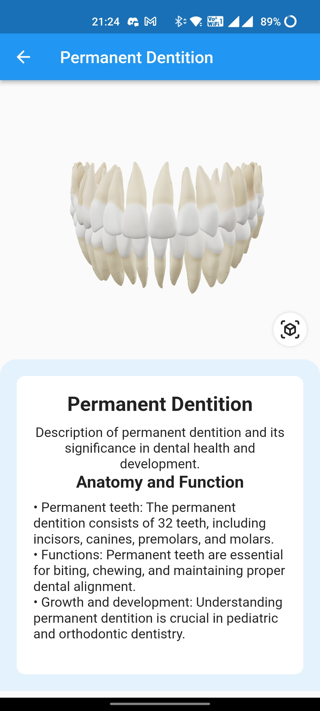
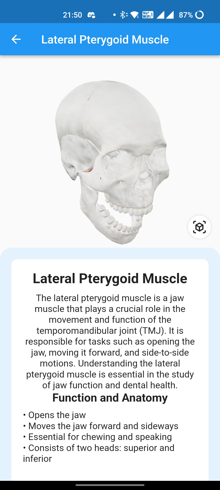

# MedARLearn
## Overview
MedARLearn is a groundbreaking educational initiative at the intersection of medicine and augmented reality (AR). It represents a transformative leap forward in the realm of medical education, leveraging cutting-edge technology to make learning about the human body captivating, accessible, and globally inclusive.
## Screenshots
### Click below to watch Video
[Click here to watch the video](https://youtu.be/i0n3rdbxsAM?si=KLpWBzBk3dsFtuGu)
|       Home Screen       |       Dental       |       Dental        |
| :----------------------: | :----------------------: | :----------------------: |
|  |  |  |

|       Human Anatomy       |       Human Anatomy       |       Human Anatomy        |
| :----------------------: | :----------------------: | :----------------------: |
|  |  |  |

## Features
- **Augmented Reality (AR)**: Immersive 3D anatomical models for hands-on learning.
- **Universal Access**: Equitable medical education for all, accessible via smartphones and tablets.
- **Lifelong Learning**: Fosters a lifelong passion for medicine and continuous knowledge acquisition.
- **Inclusivity**: Content available in multiple languages with accessibility features.
- **Engagement and Innovation**: Sparks curiosity and passion for medicine, making learning exciting.
- **Societal Impact**: Empowers informed healthcare decision-making for improved public health.

- View items in an augmented reality environment
- Browse a list of available Models 🏎️
- View moodels details, including name, model, features, and specifications
- Rotate and move the model to view it from different angles
- Take a screenshot of the AR view and save it to the gallery
- Share the screenshot with friends and family 📱

## Technology Stack

- Flutter 2.5.3
- ARKit (iOS) and ARCore (Android)
- Blender
- Flutter Packages: camera, image_gallery_saver, ar_flutter_plugin,path_provider,model_viewer_plus

## Installation and Setup

- Clone the repository from GitHub: https://github.com/Churanta/MedARLearn.git
- Open the project in Android Studio or Visual Studio Code
- Install the required packages by running the command flutter pub get
- Connect your mobile device to your computer and enable USB debugging
- Run the app on your mobile device using flutter run

## Usage

- **Medical Education**: Enhances understanding of human anatomy and medical topics for students.
- **Healthcare Professionals**: Supports skill improvement and knowledge refreshment for practitioners.
- **Dental Education**: Provides comprehensive dental anatomy and procedure learning.
- **Curious Enthusiasts**: Satisfies curiosity and offers insights into the human body.
- **Patient Education**: Helps patients understand medical conditions and treatments.
- **Classroom Use**: Enhances anatomy lessons in educational institutions.
- **Global Accessibility**: Available to diverse users worldwide.
- **Lifelong Learning**: Fosters a passion for continuous medical learning.
- **Research Aid**: Assists researchers and students in medical research.
- **Medical Simulation**: In some cases, can be used for realistic medical procedure training.

## Code Structure

- 'main.dart' : Endpoint of the app
- 'MainPage.dart' : Home screen with a list of available cars
- 'Models' : AR Screen to view model details

## Contributors

- [Churanta Mondal](https://github.com/Churanta)
- [Osho Kothari](https://in.linkedin.com/in/oshokothari)

## Future Plans

- **Content Expansion**: Add more topics and specialties.
- **Integration with Emerging Tech**: Explore VR, MR, and AI integration.
- **Educational Partnerships**: Collaborate with universities.
- **Gamification**: Add quizzes and rewards for engagement.
- **User-Generated Content**: Let users contribute educational content.
- **Interactive Case Studies**: Develop medical scenarios for users.
- **CME Credits**: Offer continuing medical education credits.
- **Healthcare Simulation**: Expand into healthcare training simulations.
- **Collaborative Learning**: Enable group study and interaction.
- **Feedback & Analytics**: Collect user data for improvements.
- **Global Reach**: Translate content and adapt to local practices.
- **Partnerships with Med-Tech**: Work with device manufacturers.
- **Telemedicine Integration**: Enhance remote patient consultations.
- **R&D**: Stay innovative with ongoing research.
- **User Support & Engagement**: Maintain strong user support and engagement channels.

## License

This project is licensed under the MIT License - see the LICENSE.md file for details..
# MedARLearn
